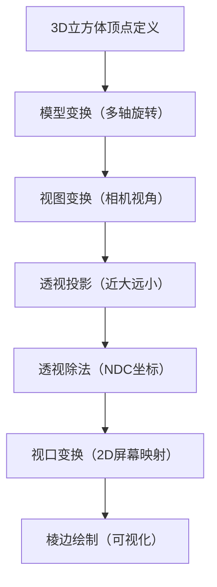

# 3D 立方体可视化（Taichi 实现）
基于 Taichi 框架开发的 3D 立方体交互式可视化程序，通过手动实现 MVP（Model-View-Projection）矩阵变换、透视投影、视口变换等核心图形学算法，实现可自由旋转的 3D 立方体渲染效果，支持按键/鼠标双交互方式。

## 项目介绍
本项目是计算机图形学 3D 渲染入门经典案例，在原有 3D 三角形变换的基础上扩展为立方体模型，完整覆盖「3D 顶点定义 → 多轴旋转变换 → 透视投影 → 2D 屏幕映射 → 交互式渲染」全流程，直观展示 3D 图形到 2D 平面的投影原理。

### 核心特性
- ✨ 多轴旋转：支持绕 X/Y/Z 三轴自由旋转，模拟真实 3D 视角变化
- 🖱️ 双交互方式：按键精准控制 + 鼠标拖动流畅旋转
- 🎯 透视投影：实现「近大远小」的真实 3D 视觉效果
- ⚡ 并行计算：基于 Taichi 核函数实现顶点变换的并行加速
- 🎨 简洁界面：黑色背景+白色立方体，聚焦 3D 变换效果

## 环境依赖
- Python 3.7+
- Taichi 1.5.0+（CPU/GPU 均可运行，GPU 渲染更流畅）

### 安装依赖
```bash
pip install taichi
```

## 快速开始
### 1. 代码运行
将代码保存为 `3d_cube_visualization.py`，终端执行：
```bash
python 3d_cube_visualization.py
```

### 2. 交互操作
| 操作方式                | 功能说明                          |
|-------------------------|-----------------------------------|
| W 键                    | 绕 X 轴顺时针旋转                 |
| S 键                    | 绕 X 轴逆时针旋转                 |
| A 键                    | 绕 Y 轴顺时针旋转                 |
| D 键                    | 绕 Y 轴逆时针旋转                 |
| Q 键                    | 绕 Z 轴顺时针旋转                 |
| E 键                    | 绕 Z 轴逆时针旋转                 |
| 鼠标左键拖动            | 自由旋转（X/Y 轴，更流畅的交互）  |
| ESC 键                  | 退出程序                          |

## 核心原理
### 整体渲染流程


### 关键模块说明
| 函数/模块                | 核心功能                                                                 |
|--------------------------|--------------------------------------------------------------------------|
| `get_model_matrix`       | 生成绕 X/Y/Z 三轴的旋转矩阵，组合实现立方体多轴旋转变换                   |
| `get_view_matrix`        | 视图变换矩阵，将相机平移至坐标原点（相机固定在 Z 轴正方向 8 个单位处）    |
| `get_projection_matrix`  | 透视投影矩阵，先挤压透视平截头体为长方体，再缩放到 [-1,1] 标准空间（NDC） |
| `compute_transform`      | Taichi 并行核函数，批量计算 8 个顶点的 3D→2D 完整变换流程                 |
| `init_cube`              | 初始化立方体几何结构：8 个顶点 + 12 条棱边的索引定义                     |
| `main`                   | 程序入口，处理交互事件、调用变换函数、绘制立方体并实现实时渲染           |

### 立方体几何定义
- **顶点**：8 个顶点分为前后两个平面（Z=-1/Z=1），中心在坐标原点，边长为 2，保证旋转时居中显示
- **棱边**：12 条棱边（4 条后平面边 + 4 条前平面边 + 4 条连接边），通过顶点索引对定义每条边的连接关系

## 代码结构
```
├── 3d_cube_visualization.py  # 主程序文件（完整可运行）
└── README.md                 # 项目说明文档
```

### 核心代码片段（MVP 矩阵组合）
```python
# 组合MVP矩阵（投影→视图→模型，右乘原则）
model = get_model_matrix(angle_x, angle_y, angle_z)
view = get_view_matrix(eye_pos)
proj = get_projection_matrix(60.0, 1.0, 0.1, 100.0)
mvp = proj @ view @ model
```

## 效果展示
### 运行界面
![3D立方体可视化效果]

### 关键视觉特征
- 立方体旋转时，靠近视角的棱边视觉上更粗，远离的更细（透视投影效果）
- 鼠标拖动时，立方体随鼠标轨迹平滑旋转，符合 3D 空间直觉
- 所有棱边保持连续，无断裂或错位（顶点变换精度保证）

## 扩展优化方向
1. **面着色功能**：为立方体 6 个面添加不同颜色，增强立体感
2. **深度测试**：实现隐藏面消除，只渲染可见的棱边/面
3. **光照效果**：添加漫反射/环境光，模拟真实光照下的明暗变化
4. **模型扩展**：替换为更复杂的 3D 模型（如金字塔、球体）
5. **交互增强**：添加缩放、平移功能，支持滚轮放大/缩小立方体
6. **性能优化**：启用 Taichi GPU 后端，提升大规模顶点的渲染速度

## 注意事项
1. 如需启用 GPU 加速，将 `ti.init(arch=ti.cpu)` 改为 `ti.init(arch=ti.gpu)`（需显卡支持 Taichi）
2. 旋转角度步长可通过修改代码中的数值调整（如 `angle_x += 5.0` 改为 `+= 3.0` 降低旋转速度）
3. 窗口分辨率可通过 `ti.GUI` 的 `res` 参数调整（如 `res=(1000, 1000)`）

## 核心知识点总结
1. **MVP 矩阵**：3D 图形学的核心变换体系，模型（旋转）→ 视图（相机）→ 投影（透视）的组合变换
2. **齐次坐标**：将 3D 顶点扩展为 4 维向量，统一处理旋转、平移、投影变换
3. **透视除法**：通过除以齐次项实现「近大远小」的透视效果，得到 NDC 标准坐标
4. **并行计算**：Taichi 核函数可自动并行处理顶点变换，提升渲染效率

本项目可作为计算机图形学 3D 渲染的入门实践案例，理解其核心逻辑后可轻松扩展到更复杂的 3D 模型渲染场景。

